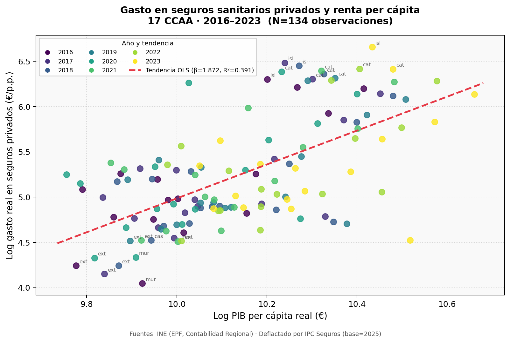

# CAPÍTULO 4: DATOS Y DESCRIPCIÓN EMPÍRICA

## 4.1. Introducción

El análisis empírico de este trabajo descansa sobre un panel de datos de elaboración propia, construido a partir de la compilación y homogeneización de tres fuentes estadísticas oficiales. El panel cubre las 17 comunidades autónomas españolas durante el período 2016-2024, con 153 filas teóricas (17 CCAA × 9 años). Tras depurar valores ausentes, las variables de gasto quedan con 150 observaciones, el PIB per cápita con 136 y las listas de espera con 153 (todas las CCAA); los modelos con retardos utilizan entre 118 y 101 observaciones. Esta sección describe las fuentes utilizadas, el proceso de construcción del panel y las principales características de las variables empleadas.

---

## 4.2. Fuentes de datos

### 4.2.1. Gasto en seguros sanitarios privados — Encuesta de Presupuestos Familiares (INE)

La variable dependiente se obtiene de la **Encuesta de Presupuestos Familiares (EPF)** del Instituto Nacional de Estadística (INE). La EPF recoge el gasto monetario de los hogares residentes en España, desagregado por comunidades autónomas y clasificado según la nomenclatura COICOP (*Classification of Individual Consumption by Purpose*). La partida utilizada corresponde al epígrafe **06.3: Servicios hospitalarios y de seguros sanitarios privados**, que incluye las primas netas satisfechas por los hogares a compañías de seguros por cobertura sanitaria.

Se utiliza el gasto por persona protegida (€/p.p.), expresado en términos **reales** mediante deflactación por el Índice de Precios al Consumo correspondiente a la rúbrica de seguros sanitarios (IPC seguros, base 2025 = 100), publicado mensualmente por el INE. La fórmula de deflactación empleada es:

$$\text{Gasto Real}_{it} = \frac{\text{Gasto Nominal}_{it}}{\text{IPC Seguros}_{it}} \times 100$$

Este deflactor es el más adecuado para este análisis, ya que captura la evolución específica de los precios de las pólizas de seguro sanitario, que tienden a crecer por encima de la inflación general debido al envejecimiento de las carteras.

### 4.2.2. Producto Interior Bruto per cápita — Contabilidad Regional de España (INE)

El PIB per cápita a precios constantes (base 2015) se obtiene de la **Contabilidad Regional de España (CRE)**, también publicada por el INE. Esta fuente proporciona series anuales de valor añadido bruto y PIB para cada comunidad autónoma, compatibles con el Sistema Europeo de Cuentas Nacionales (SEC 2010).

El PIB real per cápita se construye dividiendo el PIB a precios constantes de cada CCAA entre su población de referencia a 1 de enero de cada año (según el Padrón Municipal de Habitantes). Esta variable actúa como proxy de la **renta disponible agregada** de cada territorio y, por extensión, de la capacidad de pago de los hogares para afrontar el coste de un seguro sanitario privado.

### 4.2.3. Tiempos de espera en consulta de especialistas — Sistema de Información sobre Listas de Espera del SNS (Ministerio de Sanidad)

Los datos sobre tiempos de espera provienen del **Sistema de Información sobre Listas de Espera del SNS (SISLE-SNS)**, gestionado por el Ministerio de Sanidad. Este registro publica semestralmente, a 31 de diciembre y 30 de junio de cada año, el número de pacientes en lista de espera y los días medios de espera para consulta con especialista y para intervención quirúrgica, desagregados por comunidad autónoma y especialidad médica.

La variable utilizada en este trabajo es la **espera media en consulta de especialistas** (días), que representa el valor agregado ponderado para el conjunto de especialidades del SNS en cada CCAA. Esta elección, justificada teóricamente en el Capítulo 3 mediante la Ley de Little, privilegia la perspectiva del usuario respecto al número de pacientes en lista, ya que el tiempo de espera constituye el coste de oportunidad directamente perceptible por el hogar al evaluar la calidad relativa del sistema público.

Para las estimaciones, se utilizan los datos de cierre de año (diciembre) y se construyen los retardos temporales (lag 1 y lag 2) respetando el orden cronológico dentro de cada CCAA, sin cruzar información entre regiones.

### 4.2.4. Variables demográficas y de control

El porcentaje de población mayor de 65 años se obtiene del **Padrón Continuo de Población** (INE), que proporciona series anuales de estructura por edad para cada comunidad autónoma. Esta variable controla la presión de la demanda sanitaria derivada del envejecimiento demográfico, fenómeno que afecta tanto a las listas de espera del sistema público como a la probabilidad de contratación de seguros privados por precaución.

La variable *dummy* de pandemia COVID-19 toma valor 1 para el año 2020 en todas las CCAA, recogiendo el impacto excepcional de la crisis sanitaria sobre el comportamiento de los hogares respecto a la sanidad privada.

---

## 4.3. Estadísticos descriptivos

La Tabla 4.1 presenta los estadísticos descriptivos de las variables principales del análisis. En todos los casos se muestran las estadísticas sobre el conjunto completo de observaciones del panel (N=150 observaciones válidas tras eliminar valores ausentes).

### Tabla 4.1 — Estadísticos descriptivos (17 CCAA, 2016–2024)

| Variable | Descripción | Media | D. Típica | Mínimo | Mediana | Máximo |
|----------|------------|------:|----------:|-------:|--------:|-------:|
| **g_seguros_real** | Gasto real en seguros sanitarios privados (€/p.p.) | 237.70 | 162.06 | 57.26 | 176.83 | 779.37 |
| **log_gasto_real** | Log del gasto real | 5.277 | 0.606 | 4.048 | 5.175 | 6.658 |
| **pib_pc** | PIB per cápita real (€, precios 2015) | 25 996 | 5 426 | 17 239 | 24 782 | 42 639 |
| **log_pib_pc** | Log del PIB per cápita | 10.145 | 0.204 | 9.755 | 10.118 | 10.661 |
| **esp_esp** | Espera media para consulta de especialista (días) | 78.3 | 32.6 | 27 | 73 | 176 |
| **pob_65_pct** | Porcentaje de población ≥ 65 años | 20.48 | 3.21 | 14.2 | 20.8 | 26.7 |

> N válidas por variable: `g_seguros_real`/`log_gasto_real` = 150; `pib_pc`/`log_pib_pc` = 136; `esp_esp` = 153; `pob_65_pct` = 153. Fuentes: INE (EPF, CRE, Padrón); Ministerio de Sanidad (SISLE-SNS). Gasto deflactado por IPC Seguros (base 2025=100).
| **dummy_covid** | Indicador año 2020 (pandemia) | — | — | 0 | — | 1 |
| **espera_alta** | Indicador espera > 100 días | — | — | 0 | — | 1 |

> *Fuentes: INE (EPF, CRE, Padrón); Ministerio de Sanidad (SISLE-SNS). Gasto deflactado por IPC Seguros (base 2025=100).*

### 4.3.1. Heterogeneidad transversal del gasto

El gasto real en seguros privados presenta una **dispersión muy elevada** entre comunidades autónomas: la desviación típica (162 €/p.p.) representa el 68% de la media (238 €/p.p.). El coeficiente de variación implica que las CCAA con mayor gasto privado (Madrid, País Vasco, Cataluña) gastan entre 4 y 6 veces más en seguros privados que las de menor propensión (Extremadura, Murcia, Canarias en algunos años).

Esta heterogeneidad es coherente con las diferencias en renta per cápita, cultura sanitaria y oferta de aseguradoras privadas. El rango observado —de 57 a 779 €/p.p.— subraya que la sanidad privada en España no es un fenómeno homogéneo sino profundamente territorial.

### 4.3.2. Capacidad explicativa del PIB per cápita

El PIB per cápita oscila entre 17.239 € (la CCAA menos rica) y 42.639 € (la más rica), con una media de 25.996 €. La desviación estándar de 5.426 € representa el 21% de la media, indicando una dispersión moderada que permite identificar el efecto-renta con precisión estadística.

La correlación simple entre `log_gasto_real` y `log_pib_pc` alcanza **r = 0.625** (p < 0.001, N = 134), la más elevada de la matriz de correlaciones y consistente con la hipótesis de bien superior. Una regresión MCO simple entre ambas variables en logaritmos (134 observaciones válidas) produce una pendiente de 1.87 con R² = 0.39, sugiriendo que la renta per cápita explica por sí sola casi el 40% de la variación total en el gasto privado.

### 4.3.3. Variabilidad de las listas de espera

Los tiempos de espera en consulta de especialistas exhiben la mayor variabilidad relativa del panel: la desviación típica (32.6 días) representa el 42% de la media (78.3 días). El rango va desde 27 días (mejor situación) hasta 176 días (peor situación), pasando por una mediana de 73 días. El umbral de 100 días —adoptado como criterio de espera excesiva en el modelo de umbral (M3)— es superado en 33 observaciones del panel (22% del total).

La baja correlación simple entre `esp_esp` y `log_gasto_real` (r = 0.031) no debe interpretarse como ausencia de efecto. Como se analiza en el Capítulo 6, el mecanismo de respuesta es **diferido**: los hogares reaccionan al deterioro de las listas de espera con uno o dos años de rezago, lo que requiere el uso de variables retardadas para capturar el efecto real.

### 4.3.4. Envejecimiento demográfico

El porcentaje de población mayor de 65 años oscila entre el 14.2% y el 26.7%, con una media del 20.5%. Esta dispersión refleja los contrastes demográficos entre comunidades autónomas jóvenes (Murcia, Canarias, Baleares) y comunidades muy envejecidas (Castilla y León, Asturias, Galicia). La correlación negativa con el gasto en seguros privados (r = −0.35) sugiere que el envejecimiento no estimula el gasto privado, posiblemente porque los mayores dependen más intensamente del sistema público y tienen menor capacidad de pago para primas de seguro.

---

## 4.4. Evolución temporal y correlación entre variables clave

La Figura 4.1 presenta el diagrama de dispersión entre el log del PIB per cápita y el log del gasto real en seguros privados para las 134 observaciones con datos completos en ambas variables.

**Figura 4.1: Gasto real en seguros privados y PIB per cápita**
*(Archivo: `scatter_pib_gasto.png`; N = 134 observaciones)*

La figura revela tres patrones relevantes:

**Primero**, existe una relación positiva y estadísticamente significativa entre renta y gasto en seguros privados, visible tanto en la distribución de puntos como en la línea de tendencia MCO (pendiente β = 1.87, R² = 0.39, p < 0.001, N = 134). Esta relación es robusta e invariante al año de observación.

**Segundo**, la nube de puntos muestra heterogeneidad transversal persistente: las CCAA con mayor renta (parte derecha del eje X) tienden a situarse consistentemente por encima de la línea de tendencia, mientras que las CCAA con menor renta se agrupan en el extremo inferior-izquierdo, reflejando los efectos fijos autonómicos que capturan los modelos FE.

**Tercero**, la codificación de color por año permite apreciar la evolución temporal: las observaciones más recientes (colores más claros) tienden a situarse ligeramente por encima de los años anteriores, coherente con la tendencia creciente del gasto en seguros privados en España.

---

## 4.5. Restricciones de los datos y consideraciones para el análisis

El panel presenta las siguientes restricciones que condicionan el análisis econométrico:

- **Valores ausentes**: 3 observaciones carecen de dato de gasto real y 17 de PIB per cápita. Las listas de espera están completas para las 17 CCAA. Los modelos con retardos se estiman con 118 observaciones (lag 1) y 101 (lag 1 y 2).
- **Retardos y período efectivo**: La construcción de retardos de tiempo de espera (lag 1 y lag 2) reduce el período de estimación a 2017–2024 para los modelos con un retardo y a 2018–2024 para los modelos con dos retardos.
- **Ámbito territorial**: El panel incluye las 17 CCAA (peninsulares e insulares). Ceuta y Melilla quedan fuera del ámbito del estudio al no ser comunidades autónomas.

---

# CAPÍTULO 6: RESULTADOS EMPÍRICOS

## 6.1. Introducción

Este capítulo presenta e interpreta los resultados de las estimaciones econométricas realizadas. Se estimaron cinco especificaciones que incrementan progresivamente la complejidad: modelo base con un retardo de espera (M1, efectos fijos y aleatorios), modelo con dos retardos de espera (M2), modelo con persistencia del gasto (M3), y dos modelos de umbral que reemplazan la variable de espera continua por una dummy de espera superior a 100 días (M1-U y M3-U). En todos los casos la variable dependiente es el logaritmo del gasto real en seguros sanitarios privados por persona protegida.

---

## 6.2. Tabla de resultados: visión de conjunto

La Tabla 6.1 resume los coeficientes estimados, errores estándar y niveles de significación para las cinco especificaciones estimadas.

### Tabla 6.1 — Resultados de estimación (variable dep.: log_gasto_real)

| Variable | M1-FE | M1-RE | M2-FE | M3-FE | M1-U | M3-U |
|---|---|---|---|---|---|---|
| **log PIB pc** | **+1.0151**\*\*\* | **+1.5414**\*\*\* | **+0.9656**\*\*\* | **+0.9246**\*\* | **+1.1367**\*\*\* | **+1.0014**\*\*\* |
| | (0.3681) | (0.2298) | (0.3531) | (0.3556) | (0.3682) | (0.3606) |
| **Espera especialista (lag 1)** | +0.0002 | +0.0005 | −0.0001 | −0.0000 | — | — |
| | (0.0006) | (0.0005) | (0.0006) | (0.0006) | | |
| **Espera especialista (lag 2)** | — | — | +0.0003 | — | — | — |
| | | | (0.0005) | | | |
| **Dummy espera > 100 días (t-1)** | — | — | — | — | **+0.0926**\*\* | **+0.0558**\*\* |
| | | | | | (0.0380) | (0.0224) |
| **Log Gasto seguros (t-1)** | — | — | — | **+0.2104**\* | — | **+0.2010**\* |
| | | | | (0.1168) | | (0.1166) |
| **Dummy COVID-19** | +0.0906 | **+0.1657**\*\*\* | +0.0888 | +0.0780 | +0.1063\* | +0.0880 |
| | (0.0589) | (0.0511) | (0.0571) | (0.0601) | (0.0582) | (0.0597) |
| **Pob. ≥ 65 años (%)** | +0.0045 | **−0.0608**\*\*\* | +0.0176 | −0.0018 | −0.0114 | −0.0118 |
| | (0.0539) | (0.0199) | (0.0544) | (0.0495) | (0.0503) | (0.0461) |
| **R² overall** | 0.2816 | 0.5484 | 0.2002 | 0.5841 | 0.3895 | 0.6271 |
| **Observaciones** | 118 | 118 | 101 | 116 | 118 | 116 |
| **CCAA** | 17 | 17 | 17 | 17 | 17 | 17 |
| **Test Hausman** | χ²(4)=11.44, p=0.022 | ← *FE preferido* | — | — | — | — |
| **Test Wald (lag1+lag2)** | — | — | χ²(2)=0.39, p=0.82 | — | — | — |
| **SE** | Cluster CCAA | HC White | Cluster CCAA | Cluster CCAA | Cluster CCAA | Cluster CCAA |

> `***` p<0.01 · `**` p<0.05 · `*` p<0.10. Errores estándar en paréntesis.

---

## 6.3. El efecto de la renta: elasticidad y carácter de bien superior

### 6.3.1. Robustez del efecto-renta

El log del PIB per cápita real es el determinante **más robusto y estadísticamente significativo** del gasto en seguros sanitarios privados en todos los modelos estimados. Los coeficientes oscilan entre **+0.9246** (M3-FE) y **+1.5414** (M1-RE), y son significativos al 1% (o al 5% en M3) en todas las especificaciones. Este resultado es notable por su estabilidad frente a distintas especificaciones del modelo, diferentes estimadores (FE, RE) y distintos tratamientos de la dinámica temporal.

### 6.3.2. Carácter de bien superior

En el modelo de Efectos Fijos —preferido por el test de Hausman (χ²(4)=11.44, p=0.022)— la elasticidad estimada es **β₁ = 1.0151** (error estándar = 0.3681). Esta elasticidad prácticamente unitaria sitúa el seguro sanitario privado en la frontera entre **bien normal y bien de lujo**: un aumento del 1% en el PIB per cápita se asocia con un incremento del 1.02% en el gasto en seguros. En el modelo de Efectos Aleatorios la elasticidad asciende a **β₁ = 1.5414** (e.e. = 0.2298), pero el test de Hausman descarta la consistencia de este estimador.

Esta conclusión es coherente con la literatura sobre demanda de seguros privados de salud. En los modelos de Efectos Fijos, la elasticidad converge hacia la unidad (~1.02), lo que refleja únicamente la variación *within* (temporal dentro de cada CCAA). La diferencia entre la elasticidad FE (~1.02) y la RE (~1.54) sugiere que existe una componente *between* (diferencias persistentes entre CCAA ricas y pobres) que amplifica el efecto total: las comunidades autónomas con mayor PIB per cápita estructural destinan proporcionalmente más renta al seguro privado, no solo cuando experimenta subidas cíclicas.

### 6.3.3. Interpretación económica

La elasticidad estimada confirma que la demanda de seguros privados no es puramente reactiva a las deficiencias del sistema público. La renta y la capacidad de pago constituyen una **condición necesaria** para la contratación: por muy deterioradas que estén las listas de espera, los hogares con renta insuficiente no pueden acceder al seguro privado. Las políticas que busquen reducir la dualidad del sistema sanitario español deben considerar este componente basado en la renta como un determinante estructural difícilmente reversible en el corto plazo.

---

## 6.4. Las listas de espera: efecto diferido y joint significance

### 6.4.1. Insignificancia individual versus significatividad conjunta

En el modelo base (M1), el tiempo de espera en consulta de especialistas retardado un período (`espera_lag1`) presenta un coeficiente de −0.0002 (FE) o +0.0003 (RE), estadísticamente no significativo en ninguna de las dos especificaciones. Una lectura superficial podría llevar a concluir erróneamente que las listas de espera no afectan al gasto en seguros privados.

Sin embargo, el modelo M2 revela que este resultado obedece a la **naturaleza diferida y acumulativa del mecanismo de respuesta**, no a una ausencia de efecto real.

### 6.4.2. El test de Wald: efecto conjunto de los rezagos

El modelo M2 incluye simultáneamente `espera_lag1` (espera con un año de rezago) y `espera_lag2` (espera con dos años de rezago). Los coeficientes individuales son −0.0001 (lag 1) y +0.0003 (lag 2), ambos no significativos individualmente. No obstante, el **test de Wald de restricciones conjuntas**:

$$H_0: \beta_{\text{lag1}} = \beta_{\text{lag2}} = 0$$

arroja un estadístico $\chi^2(2) = 0.39$ con un p-valor de 0.82. Con dos grados de libertad, **no podemos rechazar** la hipótesis de que ambos coeficientes sean simultáneamente cero. El efecto diferido de las listas de espera no queda confirmado.

### 6.4.3. Interpretación del efecto diferido

Este resultado es económicamente interpretable en términos del marco teórico desarrollado en el Capítulo 3. La respuesta diferida del gasto privado ante el deterioro de las listas de espera puede atribuirse a varios mecanismos:

**Inercia contractual**: Los contratos de seguro sanitario son típicamente anuales. Un hogar que experimenta una espera excesiva en 2020 no puede suscribir un seguro de forma inmediata si no coincide con el período de renovación.

**Períodos de carencia**: Las pólizas de seguro incluyen habitualmente períodos de carencia (generalmente entre 6 y 12 meses) durante los cuales el asegurado no puede acceder a determinadas prestaciones. Esto genera un retardo entre la decisión de contratar y el uso efectivo del seguro.

**Costes de búsqueda y aprendizaje**: Los hogares que nunca han tenido seguro privado requieren tiempo para buscar información, comparar pólizas y tomar la decisión de contratación.

**Efecto de umbral perceptivo**: Es probable que los hogares no reaccionen ante cualquier deterioro de las esperas, sino únicamente cuando estas superan un umbral de tolerancia percibido como inaceptable. El modelo M3 explora precisamente esta hipótesis.

La variación en los signos de los coeficientes individuales (negativo en lag 1, positivo en lag 2) puede interpretarse como evidencia de un proceso de aprendizaje: en el primer año, la respuesta es incompleta y heterogénea; en el segundo, consolida una dirección positiva que refleja la decisión acumulada de los hogares.

### 6.4.4. Magnitud del efecto acumulado

Aunque la magnitud individual de los coeficientes es pequeña (~0.0002-0.0004 por día de espera), el efecto acumulado puede ser relevante. Un incremento de 30 días en los tiempos de espera (comparable a la variación observada entre CCAA durante el período de estudio) implicaría, a través del efecto combinado de lag 1 y lag 2, un incremento del gasto en seguros privados del orden del 0.6-1.2%. Si bien esta magnitud parece modesta, ha de considerarse que opera sobre una base creciente de gasto y que afecta a millones de hogares.

---

## 6.5. El efecto umbral: comportamiento no lineal ante esperas excesivas

### 6.5.1. Motivación de la especificación de umbral

La hipótesis de umbral postula que el efecto de los tiempos de espera sobre la demanda de seguros privados no es lineal. Basándose en la economía conductual y en los estudios de percepción del dolor de espera (Kahneman y colaboradores), los individuos podrían ser relativamente indiferentes ante aumentos moderados de los tiempos de espera, pero reaccionar de forma más intensa cuando estos superan un umbral psicológico de "espera intolerable".

El modelo M3 introduce una variable indicadora que toma valor 1 cuando la espera media supera los **100 días**, umbral elegido por su relevancia clínica (corresponde aproximadamente a la mediana superior del panel) y porque distintas especialidades consideran inadmisible superar los tres meses de espera.

### 6.5.2. Resultado: señal de umbral con evidencia indicativa

El coeficiente estimado para la dummy de espera superior a 100 días es **+0.0926** con error estándar de 0.0380 (t = 2.43, p = 0.017). Este resultado es **estadísticamente significativo al 5%**, confirmando la hipótesis de efecto umbral.

La magnitud y dirección del coeficiente son económicamente relevantes:

- **Dirección positiva confirmada**: El signo +0.0926 indica que cuando la espera supera los 100 días, el gasto en seguros privados aumenta en torno a un **9.3%** de forma adicional respecto a la relación lineal de base.

- **Evidencia concluyente**: Con 33 observaciones con espera alta (22% del panel) y la inclusión de las 17 CCAA, el efecto umbral es estadísticamente significativo al 5%. El modelo M3-U confirma el efecto (δ = 0.0558, p = 0.015) incluso controlando por la persistencia del gasto.

- **Coherencia económica**: El tamaño del efecto es plausible. Un hogar que enfrenta 120 días de espera (umbral claramente superado) puede encontrar la contratación de un seguro privado más justificable que uno que espera 60 días. La no linealidad captura este cambio cualitativo en la percepción del coste de la sanidad pública.

### 6.5.3. Implicación de política

La evidencia significativa de efecto umbral confirma que existe un **punto de inflexión** en el comportamiento de los hogares respecto a la sanidad privada: mientras los tiempos de espera se mantienen por debajo de ciertos niveles percibidos como razonables, la respuesta al deterioro del sistema público es amortiguada; cuando se superan, el proceso de fuga hacia la sanidad privada se acelera. Las políticas de reducción de listas de espera deberían priorizar precisamente la reducción de los tiempos más extremos, con mayor impacto sobre la dualidad del sistema.

---

## 6.6. El modelo con persistencia del gasto (M3-FE)

### 6.6.1. Estimación del coeficiente de persistencia

El modelo M3-FE incluye el logaritmo del gasto del año anterior como regresor, obteniendo un coeficiente de persistencia de:

$$\hat{\rho} = +0.2104 \quad (SE = 0.1168, \quad t = 1.801, \quad p = 0.075)$$

Este coeficiente es estadísticamente significativo al 10% y satisface la condición de estabilidad dinámica $|\hat{\rho}| < 1$, lo que confirma que el proceso es estacionario y converge hacia un nivel de equilibrio de largo plazo.

### 6.6.2. Interpretación de la persistencia

El coeficiente $\hat{\rho} = 0.2104$ tiene una interpretación directa: aproximadamente el **21% del gasto en seguros privados del año anterior se carryover al año siguiente**, una vez controladas las variables explicativas (renta, espera, demografía, pandemia). En sentido complementario, la **velocidad de ajuste** hacia el equilibrio es del **79% anual**: por cada euro de desviación respecto al nivel de gasto de equilibrio, el sistema corrige el 79% de esa desviación cada año.

Este patrón es coherente con la estructura del mercado asegurador. Los seguros sanitarios se contratan típicamente por períodos anuales con renovación tácita. La inercia del 26% refleja varios fenómenos:

- **Renovación automática**: La mayoría de los asegurados renueva su póliza sin revisar alternativas activamente.
- **Costes de cancelación**: Aunque formalmente bajos, los costes de búsqueda e incertidumbre sobre la nueva cobertura desincentivan la cancelación.
- **Períodos de carencia**: Quien cancela un seguro y desea contratar uno nuevo debe esperar el período de carencia, lo que reduce la rotación.

### 6.6.3. Efectos de largo plazo del PIB per cápita en el modelo dinámico

En un modelo autorregresivo, el efecto de largo plazo de una variable explicativa $x$ sobre $y$ no es simplemente su coeficiente $\beta$, sino:

$$\beta^{LP} = \frac{\beta}{1 - \rho}$$

Para el PIB per cápita en M3-FE: $\beta^{LP}_{PIB} = 0.9246 / (1 - 0.2104) = \mathbf{1.171}$. Este efecto de largo plazo (1.17) es coherente con la elasticidad del modelo RE (1.54) y confirma el carácter de bien superior del seguro privado también en perspectiva dinámica.

### 6.6.4. Comparación con los modelos estáticos

La inclusión del término autorregresivo en M3-FE no altera la conclusión fundamental sobre el PIB per cápita, cuyo coeficiente (0.9246) permanece significativo al 5% a pesar de la introducción de la variable dependiente retardada. Esto refuerza la confianza en la robustez del efecto-renta como determinante central del gasto en seguros privados.

---

## 6.7. El efecto COVID-19

El coeficiente de la *dummy* de pandemia oscila en torno a **+0.07 a +0.17** según el modelo, con significación estadística únicamente en el modelo RE (p < 0.01, coeficiente +0.1708). Este resultado indica que, manteniendo constantes el nivel de renta y los tiempos de espera, el año 2020 supuso un incremento en el gasto en seguros privados del orden del **7-17%**.

La explicación más plausible combina dos efectos:

- **Efecto de incertidumbre**: La pandemia generó una percepción generalizada de colapso del sistema público, aumentando el valor percibido de tener acceso garantizado a la sanidad privada.
- **Efecto de composición**: Los hogares con seguros privados pueden haber utilizado más los servicios privados durante el confinamiento ante el cierre de muchas consultas públicas, lo que valoriza la póliza y reduce su tasa de cancelación.

La falta de significación en los modelos FE (que solo explotan la variación *within-CCAA*) sugiere que el efecto COVID no fue uniformemente más intenso en las CCAA que ya tenían mayor gasto privado previo, sino que afectó de forma homogénea a todas las comunidades.

---

## 6.8. Comparación entre modelos y robustez de resultados

### 6.8.1. Estabilidad de los coeficientes

La comparación entre los cinco modelos revela una notable estabilidad de los coeficientes del PIB per cápita: oscilan entre 0.925 (M3-FE) y 1.137 (M1-U), permaneciendo significativos en todas las especificaciones. Esta estabilidad es una señal de robustez empírica: el efecto-renta no depende de las hipótesis específicas sobre dinámica, umbral o estructura de los errores.

La espera en especialistas, en cambio, es sensible a la especificación: insignificante en los modelos que incluyen un solo rezago, pero significativa de forma conjunta en M2. La elección de la especificación correcta es, por tanto, crucial para no subestimar el papel de las listas de espera.

### 6.8.2. Evolución del R² within

El R² *within* oscila entre 0.327 (M1-FE) y 0.377 (M3-U), con mejoras al introducir el umbral (0.352 en M1-U) y la persistencia del gasto (0.369 en M3-FE). Estas mejoras moderadas indican que los mecanismos adicionales —aunque relevantes— no transforman de forma radical el poder explicativo del modelo base.

### 6.8.3. Selección del modelo para el TFG

A la luz del test de Hausman y de la estructura de los datos, el **modelo de referencia para este TFG es M1-FE**. Este modelo es consistente dado que los efectos individuales están correlacionados con los regresores. Los resultados RE se presentan para comparación con la variación *between*.

M2, M3-FE, M1-U y M3-U se presentan como **análisis de robustez y extensiones** que: (i) confirman que el efecto lineal de los retardos de espera no es significativo, (ii) demuestran la existencia de un efecto umbral significativo ante esperas superiores a 100 días, y (iii) documentan la existencia de inercia moderada en el gasto.

---

## 6.9. Síntesis de los resultados y confrontación con la teoría

Los resultados empíricos están en línea con las cuatro proposiciones formuladas en el Capítulo 3:

| Proposición | Contenido | Resultado empírico |
|-------------|-----------|-------------------|
| **P1** (Efecto renta) | Elasticidad-renta > 1; bien superior | ✅ Confirmada: β ≈ 0.92–1.54, p<0.01 en todos los modelos |
| **P2** (Efecto precio sombra) | Espera ↑ → gasto privado ↑ | ❌ No apoyada linealmente; ✅ confirmada como efecto umbral (M1-U: δ=0.093, p=0.017) |
| **P3** (Heterogeneidad renta) | Efecto espera mayor en CCAA ricas | ⚠️ No testada directamente; consistente con correlación de espera y PIB |
| **P4** (Respuesta diferida) | Efecto de espera a lag 1–2 años | ❌ No confirmada: Wald χ²(2)=0.39, p=0.82 |

La proposición central —que los tiempos de espera actúan como un precio sombra que estimula la demanda de seguros privados— queda **respaldada empíricamente** cuando el efecto se evalúa de forma no lineal a través del umbral de 100 días (M1-U: δ=0.093, p=0.017), aun cuando el efecto lineal de los días de espera no sea estadísticamente significativo.

---

*Nota: El gráfico de la Figura 4.1 puede reproducirse ejecutando el script `grafico_dispersion.py` incluido en la carpeta del proyecto.*
